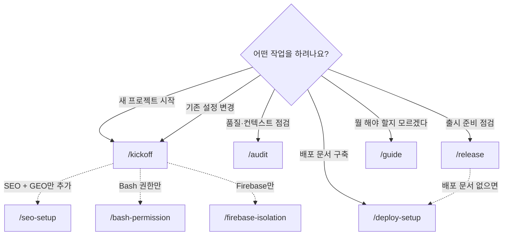
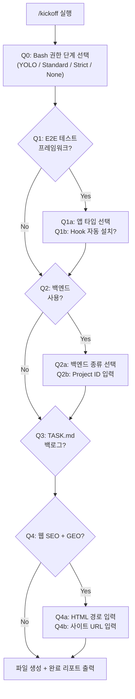

# claude-project-bootstrap

> Claude Code plugin: 네거티브 우선 원칙 + 베이스라인 E2E 하네스 + 컨텍스트 최적화로 새 프로젝트를 부트스트랩합니다.

**실전 프로젝트에서 반복된 시행착오를 다음 프로젝트의 기본값으로 적용하는 재사용 프레임워크입니다.**

**[English README](README.en.md)**

---

## 빠른 시작

```bash
# 1. 마켓플레이스 등록
claude plugin marketplace add seungjaeyuu/claude-project-bootstrap

# 2. 설치
claude plugin install claude-project-bootstrap

# 3. 새 프로젝트 폴더에서 Claude Code 실행 후:
/claude-project-bootstrap:kickoff
```

> **커맨드 네임스페이스**: 플러그인 커맨드는 `/<plugin-name>:<command>` 형식 prefix 가 필수입니다. `/kickoff` 단독 호출은 `Unknown command` 에러 — 반드시 `/claude-project-bootstrap:kickoff`.

---

## 업데이트 (기존 설치 사용자)

```bash
# 1) 마켓플레이스 메타데이터 새로고침
claude plugin marketplace update seungjaeyuu-plugins

# 2) 재설치 = 업데이트
claude plugin uninstall claude-project-bootstrap@seungjaeyuu-plugins
claude plugin install  claude-project-bootstrap@seungjaeyuu-plugins
```

> `/plugin` 대화형 UI의 **Marketplaces → Update marketplace listings** 또는 **auto-update** 토글로도 가능합니다.

---

## 제공하는 것

### 어떤 커맨드를 쓸까?

> 처음 사용한다면 `/kickoff` 으로 시작하세요. 어떤 커맨드가 필요한지 모르겠다면 `/guide` 가 안내합니다.



### 슬래시 커맨드

#### 메인 커맨드 (v0.3.0+, deploy-setup v0.3.4+)

| 커맨드 | 용도 |
|---|---|
| `/claude-project-bootstrap:kickoff` | 새 프로젝트 초기화 + 기존 프로젝트 설정 변경 (대화형 질의 최대 10회) |
| `/claude-project-bootstrap:audit` | 품질·컨텍스트·베이스라인 일괄 점검 (`--context`, `--baseline`, `--quality`) |
| `/claude-project-bootstrap:release` | 출시 준비 체크 (배포 문서 체인 + 버전, 보안, 법적, i18n, 테스트, 접근성, SEO + GEO 7대 카테고리) |
| `/claude-project-bootstrap:deploy-setup` | 배포 문서 레이지 참조 체인 구축 (CLAUDE.md → INDEX.md → DEPLOYMENT_INDEX.md → 릴리스 기록) |
| `/claude-project-bootstrap:guide` | 프로젝트 단계 자동 감지 + 적합한 커맨드 안내 |

#### 기능별 커맨드 (v0.2.0+, 하위호환 유지)

| 커맨드 | 용도 |
|---|---|
| `/claude-project-bootstrap:baseline-review` | → `/audit --baseline` 으로 통합 (하위호환 유지) |
| `/claude-project-bootstrap:bash-permission` | Bash 권한 단계 도입·변경 (YOLO/Standard/Strict/None) |
| `/claude-project-bootstrap:firebase-isolation` | Firebase 격리 도입 (`.firebaserc` + predeploy hook) |
| `/claude-project-bootstrap:slim-claude-md` | CLAUDE.md 슬림화 + 영역별 RULES 분리 |
| `/claude-project-bootstrap:doc-size-hook` | 문서 크기 임계치 hook 도입 (CLAUDE.md 120줄 / RULES 250줄) |
| `/claude-project-bootstrap:seo-setup` | 기존 웹 프로젝트에 SEO + GEO 가이드라인·검증 스크립트·hook 도입 |

### `/kickoff` 워크플로우

`/kickoff` 실행 시 대화형 질의를 통해 프로젝트에 필요한 옵션만 선택합니다. 각 질의에서 Yes를 선택하면 하위 질의가 추가됩니다.



> 모든 질의의 기본값은 **No** 입니다. 아무것도 선택하지 않으면 최소한의 파일만 생성됩니다 (Minimal tier).

### 생성되는 파일 (옵션별)

| 옵션 | 생성되는 파일 |
|---|---|
| 기본 (모두 필수) | `CLAUDE.md`, `INDEX.md`, `.gitignore`, `.claudeignore`, `.secret/.gitkeep` |
| `.claude/commands/` | `build.md`, `check.md`, `status.md` (빌드 명령 분리) |
| E2E 테스트 프레임워크? (Yes) | `TESTING_FRAMEWORK.md`, `{APP}_BASELINE.md`, `scripts/baseline.yml` |
| Firebase/Supabase? (Yes) | default-deny 보안 규칙 안내 + `.env.example` 초안 |
| Hook 자동 설치? (Yes) | `.claude/settings.json`, `.git/hooks/pre-commit` + `post-merge` symlink, `scripts/check_*.py` |
| TASK.md 백로그? (Yes) | `TASK.md` + `tasks/DEV-XXX.md` 2계층 구조 |
| 웹 SEO + GEO? (Yes) | `SEO_GUIDELINE.md`, `scripts/check_seo.py`, `docs/rules/RULES_SEO.md`, `docs/rules/RULES_GEO.md` |

### 생성 파일 구조

모든 옵션을 Yes로 선택했을 때의 프로젝트 구조입니다. 실제로는 선택한 옵션에 따라 필요한 파일만 생성됩니다.

```
your-project/
├── CLAUDE.md                        ← 횡단 가드레일 + 발견 트리거 (~99줄)
├── INDEX.md                         ← 프로젝트 지도
├── .gitignore                       ← 보안·생성물 보호
├── .claudeignore                    ← 컨텍스트 최적화
├── .secret/                         ← 비밀 파일 (git 제외)
│
├── .claude/
│   ├── settings.json                ← Bash 권한 + Hook 설정
│   └── commands/
│       ├── build.md                 ← /build 커맨드
│       ├── check.md                 ← /check 커맨드
│       └── status.md                ← /status 커맨드
│
├── docs/
│   ├── rules/                       ← 영역별 RULES (on-demand 로딩)
│   │   ├── RULES_E2E.md
│   │   ├── RULES_DATA_INTEGRITY.md
│   │   ├── RULES_ACCESSIBILITY.md
│   │   ├── RULES_VERSIONING.md
│   │   ├── RULES_SEO.md
│   │   ├── RULES_GEO.md
│   │   └── ...
│   └── test/
│       └── baseline/                ← E2E 베이스라인 문서
│
├── scripts/
│   ├── pre-commit-framework.sh      ← pre-commit hook 본체
│   ├── post-merge.sh                ← post-merge hook
│   ├── check_seo.py                 ← SEO 14항목 검증
│   ├── check_doc_size.py            ← 문서 크기 검증
│   ├── check_accessibility_identifiers.py
│   └── ...
│
├── SEO_GUIDELINE.md                 ← SEO + GEO 가이드라인 (웹 프로젝트)
├── TESTING_FRAMEWORK.md             ← E2E 테스트 규약
├── TASK.md                          ← 개발 백로그 인덱스
└── tasks/                           ← 백로그 상세 (DEV-XXX.md)
```

### 영역별 RULES (on-demand 로딩)

CLAUDE.md 본체(~99줄)는 횡단 가드레일 + 발견 트리거 표만 유지. 작업 시점에 해당 RULES만 read:

| RULES 파일 | 트리거 |
|---|---|
| `RULES_E2E.md` | E2E 테스트 / Codex orchestrator 작업 |
| `RULES_DATA_INTEGRITY.md` | Firestore / 백엔드 데이터 호출 |
| `RULES_ACCESSIBILITY.md` | UI 컴포넌트 편집 |
| `RULES_TERMINOLOGY.md` | 도메인 용어 등장 |
| `RULES_DICT_DUPLICATES.md` | dict literal 편집 |
| `RULES_REFACTORING.md` | 100줄+ 파일 변경 / 대규모 리팩토링 |
| `RULES_VERSIONING.md` | 버전 변경 / 릴리스 / main 커밋 |
| `RULES_PROJECT_LIFECYCLE.md` | 출시 준비 / 프로젝트 단계 점검 |
| `RULES_SEO.md` | 랜딩 페이지 HTML / 메타 태그 / SEO·GEO 관련 수정 |
| `RULES_GEO.md` | llms.txt / llms-full.txt / LLM 크롤러 / GEO 관련 수정 |

### 빌드번호 자동 관리

| 플랫폼 | 정본 파일 | Hook 동작 |
|---|---|---|
| iOS (XcodeGen) | `project.yml` → `CURRENT_PROJECT_VERSION` | pre-commit: +1 자동 증가 + `xcodegen generate` + `.xcodeproj` staging |
| Android | `build.gradle(.kts)` → `versionCode` | pre-commit: +1 자동 증가 |
| Web / Node | `package.json` → `buildNumber` | pre-commit: +1 자동 증가 |

`post-merge` hook: merge 후 `project.yml` 변경 감지 시 `.xcodeproj` 자동 재생성 (빌드번호 불변).

---

## 설계 철학

**네거티브 우선** — 규칙은 "하지 말라"만 적고 그 외는 모두 허용. LLM이 자력 판단 가능한 일반 모범 사례는 제외.

**4층 규칙 범례** — 각 규칙에 강제력 수준을 명시합니다:


| 층위 | 의미 | 예시 |
|---|---|---|
| 🚫 Guardrail | 위반 시 커밋 차단 또는 즉시 수정 | `git reset --hard` 사용 금지 |
| 📐 Schema | 정해진 형식을 따라야 함 | 빌드번호는 정본 파일에서만 관리 |
| 📎 참조 | 필요 시 참고하는 자료 | 테스트 작성 가이드라인 |
| 💡 권장 | 따르면 좋지만 강제는 아님 | Notion에 개발계획 기록 |

**컨텍스트 윈도우는 유한 자원** — ~200K 토큰 중 플러그인/MCP가 ~19% 소비. `.claudeignore`, `enabledPlugins`, on-demand RULES로 최적화.

**단일 SSOT + 발견 경로 최적화** — 같은 규칙을 여러 곳에 복붙하지 않음. 작업 종류 → RULES 매핑 트리거 표로 필요한 시점에만 read.

상세 근거: [`docs/design-principles.md`](docs/design-principles.md)

---

## 문서

- [설계 원칙](docs/design-principles.md)
- [내부 결정 로그](docs/changelog-decisions.md)
- [마이그레이션 가이드](docs/migration-guide.md) (기존 `_PROJECT_FRAMEWORK` 사용자)
- [CHANGELOG](CHANGELOG.md)

---

## Contributing

See [CONTRIBUTING.md](CONTRIBUTING.md). Issues and PRs welcome.

## License

[MIT](LICENSE) © 2026 Yu Seungjae
